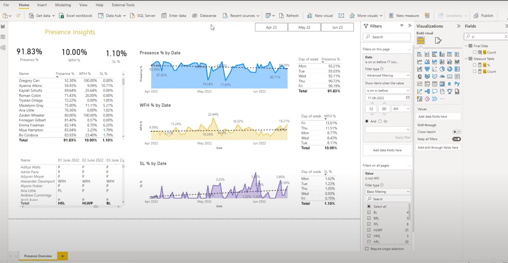

# HR Analytics Power BI Dashboard

This is a comprehensive HR analytics dashboard created using real employee presence data. The project is focused on understanding employee attendance behavior and helping HR teams make informed, data-driven decisions.

## 📌 Project Objective

The goal of this project is to design a dynamic, interactive dashboard in Power BI that visualizes and tracks key HR metrics such as employee attendance, work-from-home trends, and sick leave patterns.

---

## 🔍 Key Features

- Designed for HR decision-makers to track monthly attendance performance.
- Built an end-to-end Power BI solution from raw Excel data files.
- Created dynamic DAX measures to calculate:
  - Total working days
  - Present days (including partial WFH)
  - Work-from-home %
  - Sick-leave %
- Constructed a responsive and clean dashboard layout optimized for clarity and usability.

---

## ⚙️ Workflow Summary

1. Collected and organized raw employee attendance data (Excel format).
2. Used **Power Query** to clean, transform, and unpivot multiple month-wise datasets into a single table.
3. Built a well-structured data model for analysis.
4. Created various DAX measures to calculate key performance indicators.
5. Designed an interactive dashboard with slicers and charts showing:
   - Monthly trends
   - Day-wise presence analysis
   - Employee-level insights
   - Overall attendance summary

---

## 📊 Insights Delivered

- Identified patterns in work-from-home behavior across days of the week.
- Provided month-wise attendance trends to detect dips or spikes.
- Analyzed employee-specific metrics to highlight frequent absentees.
- Quantified the proportion of sick leaves and WFH days to support HR planning.

---

## 🛠 Tools & Technologies Used

- **Power BI Desktop**
- **Power Query**
- **DAX (Data Analysis Expressions)**
- **Excel (Raw Data Handling)**

---

## 🧪 Dataset

The dataset consists of anonymized employee presence data for a period of 3 months. Each file contains daily attendance information, with values indicating:
- 1: Present
- 0.5: Partial Work from Home
- 0: Absent or Sick Leave

---

## 🚀 How to Run the Project

1. Clone this repository or download the `.pbix` file.
2. Ensure Power BI Desktop is installed.
3. Open the project in Power BI.
4. Load and refresh the data (you may need to connect the Excel source files).
5. Explore the interactive dashboard and tweak it based on your own dataset or HR use case.

---

## 📈 Dashboard Screenshots

---

## 📬 Contact  
Let’s connect!  
📧 Email: prathameshpanchal302@gmail.com  
🔗 LinkedIn: [Prathamesh Panchal](https://www.linkedin.com/in/prathamesh-panchal-72129120a/)  
🌐 Location: Mumbai, India  

---

## 🏷️ Tags  

`#PowerBI` `#DAX` `#HRAnalytics` `#EmployeeInsights` `#DataAnalytics` `#DashboardDesign` `#BusinessIntelligence` `#InteractiveDashboard` `#DataVisualization` `#BIProject`

